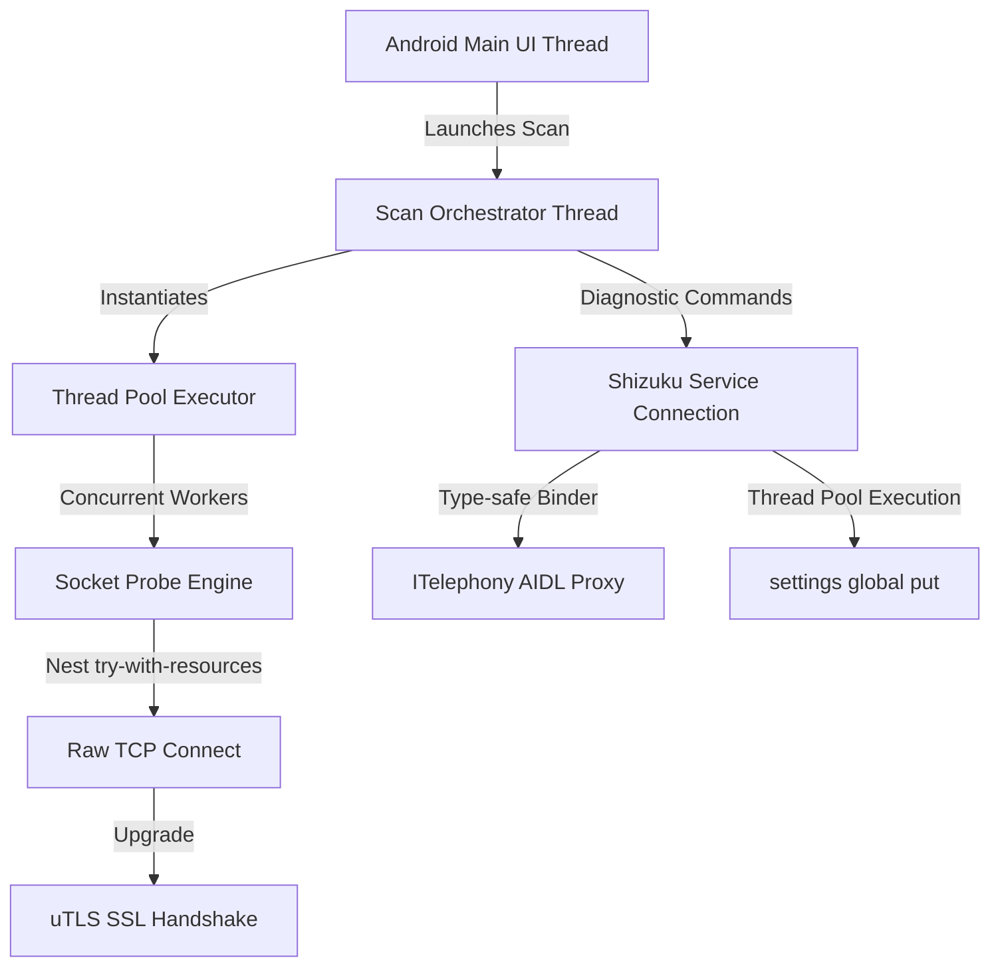

# MaybeEdgeScanner Architectural Guide & Engineering Manual

This document provides an institutional-grade, corner-to-corner technical breakdown of **MaybeEdgeScanner**'s architecture, subsystems, memory management, and network security profiles.

---

## 1. System Architecture Overview

MaybeEdgeScanner is designed as a hybrid Android application that leverages a highly responsive programmatic Java UI and a high-performance, concurrent Go scanning engine (`go-sidecar`). 



### 1.1 Symmetrical Coexistence & Sibling Architecture
MaybeEdgeScanner maintains strict behavioral and layout symmetry with its sibling project, **MaybeScanner**, sharing identical layouts, diagnostic modules, and platform boundaries. The single intentional difference lies in the scanning target mapping:
* **MaybeEdgeScanner** is the route-pairing sibling for SNI-heavy edge tests. It keeps target IPs/hosts and SNI routes as separate scan-shaping inputs so users can test primary-route behavior or expand across all bundled/custom SNI hosts.
* **MaybeScanner** is an IP-first target scanner. It directly audits target IPs or domains. SNIs extracted from certificates during handshakes are logged as host hints.

---

## 2. Low-Level Network I/O & Socket Safeguards

### 2.1 The Try-With-Resources Anti-Leak Pattern
To prevent socket and file descriptor leaks under heavy parallel scanning loads (processing thousands of subnets with up to 128 threads), the scanning client uses a nested, secure try-with-resources architecture:

```java
// Outer try block guarantees raw TCP socket cleanup on any exception
try (Socket raw = new Socket()) {
    long connectStart = System.currentTimeMillis();
    raw.connect(new InetSocketAddress(ip, port), timeout);
    tcpPass = true;
    tcpLatencyMs = System.currentTimeMillis() - connectStart;
    raw.setSoTimeout(timeout);
    
    // Inner try block upgrades the raw TCP socket and guarantees SSL socket cleanup
    try (SSLSocket ssl = (SSLSocket) ((SSLSocketFactory) SSLSocketFactory.getDefault())
            .createSocket(raw, host, port, true)) {
        ssl.setSoTimeout(timeout);
        configureTlsSocket(ssl, activeMode, true); // Active HTTP mode configures ALPN/HTTP
        ssl.startHandshake();
        
        // Extract metrics and certificates safely
        tlsPass = true;
        tlsLatencyMs = System.currentTimeMillis() - t;
        tlsVersion = ssl.getSession().getProtocol();
        tlsCipher = ssl.getSession().getCipherSuite();
        alpn = selectedAlpn(ssl);
        
        Certificate[] certs = ssl.getSession().getPeerCertificates();
        if (certs.length > 0 && certs[0] instanceof X509Certificate) {
            X509Certificate c = (X509Certificate) certs[0];
            tlsCert = c.getSubjectX500Principal().getName();
            certFingerprint = sha256(c.getEncoded());
        }
    }
} catch (Exception e) {
    reason = classify(e);
}
```

#### Mathematical File Descriptor Protection:
1. **Guaranteed Cleanup**: If the raw TCP connection succeeds (`raw.connect()` completes) but the subsequent SSL handshake, certificate parsing, or ALPN selection throws an exception, the outer `try` block ensures `raw.close()` is called implicitly, returning the file descriptor to the OS immediately.
2. **Auto-Close Upgrades**: Decorating the raw socket inside `createSocket(..., true)` flags `autoClose = true`. Consequently, closing the upgraded `SSLSocket` automatically triggers the teardown of the underlying TCP socket.

---

## 3. Privileged Telephony & Baseband Diagnostics (Shizuku Binder)

MaybeEdgeScanner incorporates a type-safe privileged subsystem using Shizuku to communicate with the Android OS baseband services.

```text
  [Android ServiceManager] ---> Maps IBinder for "phone"
             │
             ▼
  [ITelephony$Stub.asInterface] ---> Maps type-safe ITelephony Binder Proxy
             │
             ▼
  [PrivilegedTelephonyBasebandManager] ---> Asynchronously mutates network types on Worker Thread
```

### 3.1 Type-Safe AIDL Interface
Rather than executing raw shell scripts (which introduces parsing errors, string manipulation bottlenecks, and potential command injections), the app accesses the internal `phone` service directly using compile-time checked AIDL interfaces:

```aidl
package com.android.internal.telephony;

interface ITelephony {
    boolean setPreferredNetworkType(int subId, int networkType);
    int getPreferredNetworkType(int subId);
}
```

### 3.2 Non-Blocking Thread Execution
All privileged radio mutations and Shizuku process forks are offloaded from the main UI thread to prevent Application Not Responding (ANR) flags:
* Spawns settings and shell modifications inside Android's global `AsyncTask.THREAD_POOL_EXECUTOR`.
* Bundles multiple setting alterations into a single shell execution script (`settings put global key value ; settings put ...`), reducing kernel context switches to a single invocation.

---

## 4. UI/UX Coordinate Easing & Adaptability System

The user interface of MaybeEdgeScanner is programmatically generated in pure Java to maintain extreme responsiveness and high layout densities.

### 4.1 Scaffold & Layout Structure
* **Dynamic Tab Transitions**: Uses three independent, isolated `ScrollView` containers (`targetScroll`, `liveScroll`, `diagnosticsScroll`) in a central `FrameLayout` `contentContainer` between the pinned top header and bottom navigation bar. Tab selection toggles visibility (`VISIBLE` / `GONE`) directly with smooth alpha fade animations, preserving scroll position.
* **Resilience to Resizing**: Standardizes programmatic height metrics to use `wrap_content` or layout weight rather than absolute pixel bounds. This guarantees flawless rendering under:
  - Multi-window split-screen resizes.
  - Folding phone screen expansions.
  - System font size overrides and accessibility scaling.

### 4.2 Aesthetics, Haptics & Visual Feedback
* **Single-Physical-Pixel Borders**: On high-DPI screens, cards are bordered with exactly `1` physical pixel (`1.0f / resources.getDisplayMetrics().density`) with a low-opacity white stroke to construct an ultra-premium glassmorphic outline.
* **Micro-Animations**: Toggle events utilize `TransitionManager.beginDelayedTransition` to animate arrow rotations (`0f` -> `180f`) and card height expansions smoothly.
* **Haptic Click Profiles**: Taps on card titles and operation buttons trigger context haptics (`HapticFeedbackConstants.CONTEXT_CLICK`) and touch-scale scaling (`0.98f`) for physical feedback.

---

## 5. Go Sidecar Architecture & Internals

The companion Go sidecar includes a robust suite of defenses:
* **Route and provider prefix index**: IP subnets are parsed into a pointer-linked prefix helper protected by ordinary synchronization. It supports route-pairing and provider annotation; it is not lock-free, arena-backed, or proof of end-to-end provider execution.
* **Compact dedup maps**: Evaluates IP targets as compact `map[[16]byte]bool` sets rather than repeated string operations (`.String()`), reducing heap churn during expansion. This is not a lock-free routing or prefix-index claim.
* **Rolling Read/Write Deadlines**: Prevents slow-rate socket exhaustion by enforcing dynamic socket deadlines:
  ```go
  _ = conn.SetReadDeadline(time.Now().Add(750 * time.Millisecond))
  ```
* **Adaptive Backoff Scoping**: Binds the error ring-buffer *outside* of individual scanning batch loops. This preserves accurate, long-term latency contexts and protects upstream services from load spikes.

---

## 6. Memory Management & Lifecycle Safeguards

### 6.1 Clean Executor Service Teardown
When the user exits the scanning utility, background work must terminate instantly. We enforce this inside `onDestroy()`:

```java
@Override
protected void onDestroy() {
    super.onDestroy();
    stop.set(true);
    if (executor != null) {
        executor.shutdownNow(); // Interrupts active scan workers
    }
    if (previewExecutor != null) {
        previewExecutor.shutdownNow(); // Cleans up target resolution pools
    }
}
```

### 6.2 Single-Top Activity Routing
By defining `android:launchMode="singleTop"` on `MainActivity` and overriding `onNewIntent(Intent)`, we route all widget click actions and tile activations into the existing activity instance. This avoids launching redundant application instances and maintains scanning telemetry session state.

### 6.3 Thread-Safe Log Filtering & Non-Blocking Diagnostics
To preserve UI smoothness while displaying and filtering massive logs generated by high-speed concurrent scans:
1. **Thread-Safe Filter Lock**: Log appending operates concurrently with the search text input. In `refreshLogViewDirect()`, we capture the filter query, and then synchronize on the shared list:
   ```java
   synchronized (logLines) {
       for (String x : logLines) {
           if (x.toLowerCase(Locale.US).contains(filter)) {
               sb.append(x).append('\n');
           }
       }
   }
   ```
   This prevents concurrent modification exceptions while the background scan threads append to `logLines`.
2. **Dedicated Diagnostic Thread**: Triggering the Network Diagnostic Suite spawns a custom named thread `network-diagnostic-thread` which performs blocking latency queries (DNS lookups, socket connects, HTTPS requests) without pausing Android's Main Looper (UI thread), thus preventing Application Not Responding (ANR) dialogs. Results are safely updated on the UI via `ui.post(...)` handlers.
